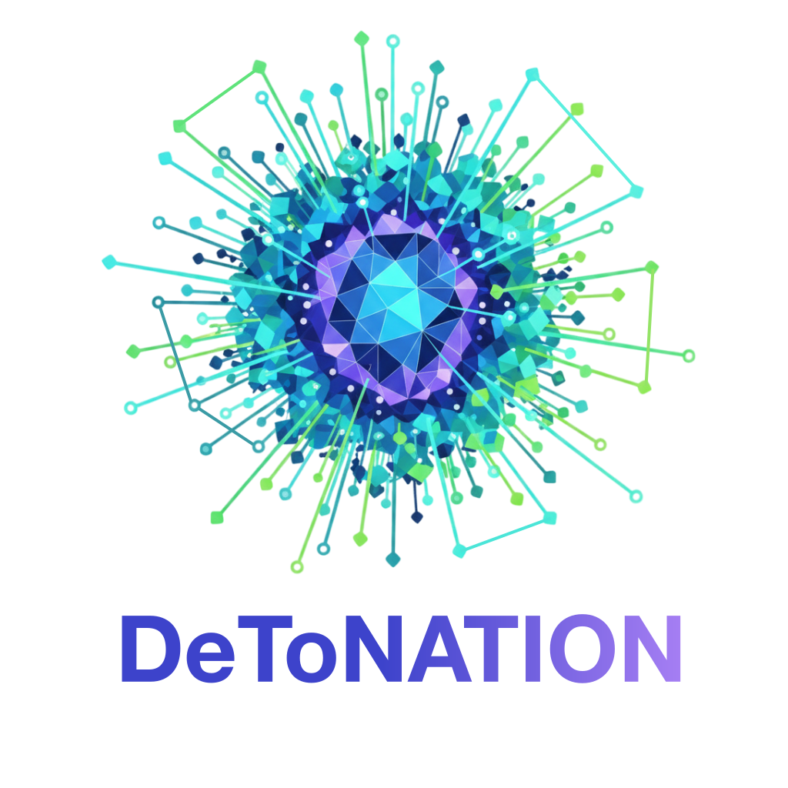

<div align="center"\>


# **DeToNATION**

### **Decoupled Torch Network-Aware Training on Interlinked Online Nodes**

[](https://arxiv.org/abs/2502.06728)
[](https://aaai.org/)
[](LICENSE)
[](https://www.python.org/downloads/)
[](https://pypi.org/project/detonation/)
</div>

## **📖 Abstract**

**DeToNATION** is a communication framework designed to optimize distributed AI training. This repository contains an implementation of the results described in the paper **"DeToNATION: Decoupled Torch Network-Aware Training on Interlinked Online Nodes"**, accepted at **AAAI 2026**. An implementation to run all experiments from the paper is found in the benchmarks folder.

The framework addresses latency bottlenecks in heterogeneous clusters by decoupling communication from computation, allowing for significantly faster convergence on low-bandwidth networks.

## **🛠️ Installation**

### **Setup**

#### Installation from PyPI:

```bash
pip install detonation
```

#### Installation from source:
```bash
git clone https://github.com/schneiderkamplab/DeToNATION
cd DeToNATION
pip install .
```


## **⚡ Getting Started**

### Examples

There is a a full example for language model training using FlexDeMo in the example folder. Please refer to the documentation [examples/t5/README.md](examples/t5/README.md)

This example demonstrates the use of the `prepare_detonation` function for obtaining a distributed model and optimizer.

### Benchmarks
There is a a full benchmarking example for language model training using FlexDeMo in the benchmarks folder. Please refer to the documentation [benchmarks/t5/README.md](benchmarks/t5/README.md)

This benchmarking example demonstrates the use of the `prepare_detonation` function for obtaining a distributed model and optimizer, and uses [aim](https://aimstack.io/) and [mltiming](https://github.com/schneiderkamplab/mltiming) to track model parameters and performance.

### Usage
The direct usage of DeToNATION without using `prepare_detonation` requires three elements as exemplified below for the FlexDeMo optimizer, i.e., DeToNATION with node-based hybrid sharding using DeMo replication.

First, you need to wrap your model with FSDP and the hybrid sharding strategy:
```python
from torch.distributed.fsdp import FullyShardedDataParallel as FSDP
model = FSDP(
    model,
    sharding_strategy=ShardingStrategy.HYBRID_SHARD,
)
```

Then, you can import and instantiate the FlexDeMo optimizer:
```python
from detonation import DeMo
optim = DeMo(
    compression_topk=16,
    compression_chunk=128,
    sharding_parallel_group=model.process_group,
    replication_parallel_group=model._inter_node_pg,
)
```

Third and last, you need to wrap the forward and backward pass using a
`no_sync` context manager to avoid automatic full gradient synchronization:
```python
    with model.no_sync(): # Disable gradient synchronizations across FSDP instances.
        loss = model(input_ids=batch["input_ids"],labels=batch["labels"])["loss"]
        loss.backward()
```

## **🤝 Contributing**

We welcome contributions\! If you find a bug or want to propose a new feature:

1. Open an issue to discuss the change.
2. Fork the repo and create a Pull Request.

## **📜 Citation**

If you find this code useful for your research, please cite our paper:
```bibtex
@inproceedings{From2026DeToNATION,
  title={DeToNATION: Decoupled Torch Network-Aware Training on Interlinked Online Nodes},
  author={From, Mogens Henrik and Nielsen, Jacob and Poech, Lukas Galke and Schneider-Kamp, Peter},
  booktitle={Proceedings of the 40th Annual AAAI Conference on Artificial Intelligence (AAAI 2026)},
  year={2026}
}
```

## **📄 License**

This project is licensed under the **BSD 3-Clause License**. See the [LICENSE]() file for details.